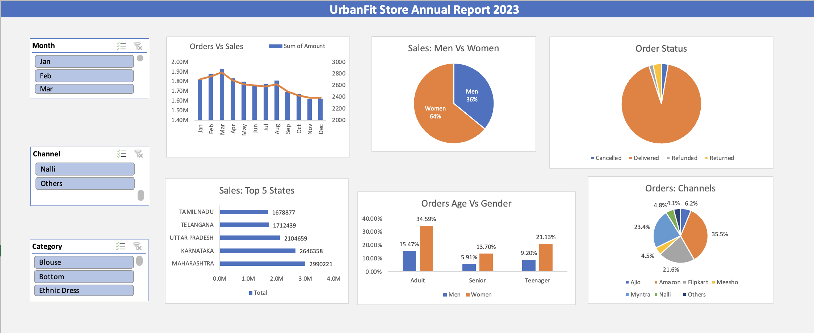

# UrbanFit Store Data Analysis

# Overview
This project offers a detailed analysis of UrbanFit's 2023 sales and customer demographics. By examining sales trends, order statuses, and customer profiles, it provides key insights into store operations and market reach, serving as a valuable resource for informed business decisions.

# Data Breakdown

- Sales vs Orders: Monthly sales and order counts, highlighting trends over the year.
- Men vs Women: Gender-based sales comparison to understand spending patterns.
- Order Status: Breakdown of orders by status (Delivered, Cancelled, Refunded) to assess fulfillment efficiency.
- States: Sales distribution by Indian states, identifying key markets.
- Age & Gender: Order distribution across age groups and genders, profiling customer demographics.
- Channels: Performance across sales platforms (e.g., Amazon, Flipkart).
- Store Data: Detailed transaction data, including customer and product information for in-depth analysis.

# Purpose

Use this data to:
- Track sales trends and customer behavior.
- Optimize marketing strategies based on demographic insights.
- Improve order fulfillment processes.
- Evaluate the effectiveness of various sales channels.

# Dashboard

